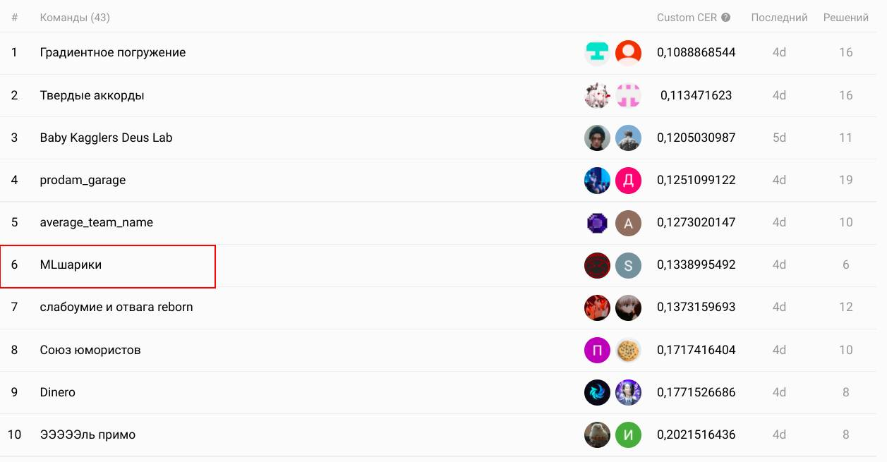
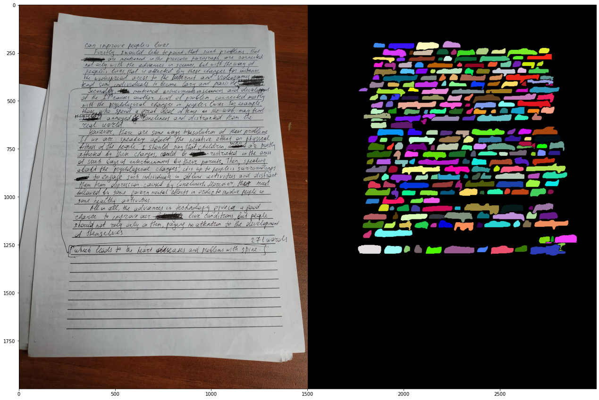

# Распознавание рукописного текста в школьных тетрадях
[Соревнование](https://ods.ai/competitions/nto_final_21-22), проводимое в рамках олимпиады НТО

6 место на [паблике](https://ods.ai/competitions/nto_final_21-22/leaderboard) и 7 на привате

<!--  -->

## Задача
Вам нужно разработать алгоритм, который способен распознать рукописный текст в школьных тетрадях. В качестве входных данных вам будут предоставлены фотографии целых листов. Предсказание модели — список распознанных строк с координатами полигонов и получившимся текстом.

## Общий пайплайн решения
1) Найти области каждого слова на изображении
2) Определить на каком языке писали на этой фотографии (англиский/русский)
3) Каждую найденную область прогнать через OCR модель и распознать что там написано

## Кратко
* Instance Segmentation = crop + maskrcnn_resnet50_fpn
* Language classification = resnet_34
* Ocr = microsoft/trocr-small-handwritten + hkr + generating dataset + HandWrittenBlot

## Инcтсанс Сегментация
В качестве модели распознавания мы попробовали две модели: detectoRS - одна из моделей зоопарка [mmdetection](https://github.com/open-mmlab/mmdetection) и предобученный на COCO maskrcnn_resnet50_fpn (реализовали на торче).

#### 1) DetectoRs
> [Обучение detectoRs](notebooks/detecting_words.ipynb)
> 
> [Использование detectoRs](notebooks/Full-text-recognition-mmdetection.ipynb)

Использовали дефолтную версию из mmdetection. При обучении ресайзили картинку в (1333, 800) и предсказывали сразу все слова на изображение
<!--  -->

#### 2) Mask rcnn
> [Обучение mask_rcnn](notebooks/Instance_Segmentation.ipynb)
>
> [Использование mask_rcnn](notebooks/Full-text-recognition.ipynb)

Чтобы размеры картинок не были помехой (были и вертикальные и горизонтальные сэмплы), модель обучили на кропах размерами (256, 256), а предсказание полигонов происходило в несколько этапов:
1) Сжать размер картинки в 4 раза
2) Пройтись окном (256, 256) и сделать предсказания
3) Склеить слова на границах окон

Для того, чтобы склеивание происходило быстрее [алгоритм сопоставления](mask_creation) цветов был переписна на numba.jit



## Определение языка
> [Мультиязычный trOcr](notebooks/multilingual_ocr.ipynb)
> 
> [Обычная бинарная классификация](notebooks/Language_classification.ipynb)

Так как на одной фотографии мог быть либо только русский, либо только англиский, то мы брали несколько слов из тех, что нашли при помощи сегментации и распознавали на каком языке они были написаны. Потом смотрели каких слов больше (русских или англиских) и в зависимости от этого определяли язык.

Было два способа распознавать язык

1) Обучить trOcr на русском и англиском языке и просто получать с них предикт. Хоть CER у такой мультиязычной модели был и больше чем у тех, что обучены по отдельности, язык она практически не путала, однако довольно долго работала
2) Дообучить resnet_34, чтобы он определял какой это язык. Данная модель косячила заметно чаще, но зато была шустренькой

В итоге остановились на втором варианте, так как первый чуть-чуть не залезал в тайм лимит

## Распознавание текста
При обучение модели распознавания текста мы во многом вдохновились [статьей](https://habr.com/ru/post/535224/) ребят, которы заняли первое место на Digital Petr

### Модель
> [Обучение английской модели](notebooks/english_ocr.ipynb)
> 
> [Обучение русской модели](notebooks/sergey_ocr.ipynb)

В качестве модели распознавания текста была использована state-of-the-art модель [trOcr](https://huggingface.co/docs/transformers/model_doc/trocr): Transformer-based Optical Character Recognition. Мы дообучали `microsoft/trocr-small-handwritten` на нашем датасете и смогли выбить `CER=0.04` для русского языка и `CER=0.06` для англиского.

### Датасет
> [Генерация датасета](notebooks/stackmix-usage-bg-smoothing-colab.ipynb)

Для обучения русскоязычной модели мы собрали соединили несколько датасетов:
1) Тот, что дали огранизаторы соревнования
2) [HKR](https://github.com/abdoelsayed2016/HKR_Dataset) (Handwritten Kazakh and Russian) dataset 
3) Сгенерированные нами данные. Так как из модели, которая используют CTC Loss можно достать границы букв в словах, то мы смогли разбить данные нам слова на буквы и потом склеивать собственные слова (подробнее про генерацию датасета [туть](https://habr.com/ru/post/535224/#%D0%B0%D1%83%D0%B3%D0%BC%D0%B5%D0%BD%D1%82%D0%B0%D1%86%D0%B8%D0%B8)).


Для англиского языка было взято всего два датасета
1) Тот, что дали организаторы соревнования
2) [IAM](https://fki.tic.heia-fr.ch/databases/iam-handwriting-database) dataset - стандартный датасет для OCR на англиском

### Аугментация
Чтобы добится лучшего качества распознавния мы добавили аугов
```
transforms = A.Compose([
              A.Resize(384, 384),
              AlbuHandWrittenBlot(blots, p=0.3),
              A.Rotate(limit=[-7, 7]),
              A.OneOf([
                A.ToGray(always_apply=True),
                A.CLAHE(always_apply=True, clip_limit=15),
              ], 0.3)
          ])
```

Из нестандартных аугментаций были использованы [HandWrittenBlot](https://habr.com/ru/post/535224/#%D0%B0%D1%83%D0%B3%D0%BC%D0%B5%D0%BD%D1%82%D0%B0%D1%86%D0%B8%D0%B8) - имитация рукописных почеркушек, которые также использовали в сореве по распознавнию рукописей петра I.
